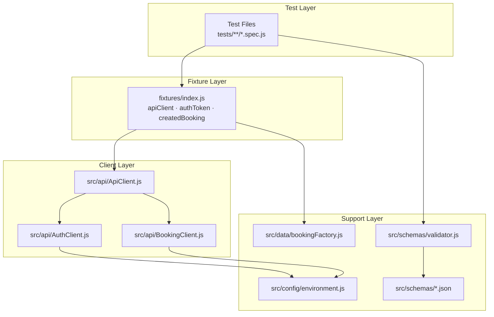

# Design Document: Framework Upgrade

## Overview

This document describes the technical design for upgrading the existing Playwright API test automation framework. The current state is 10 flat spec files that make raw `request` calls, use hardcoded credentials and booking IDs, have no environment configuration, no fixtures, no schema validation, and no CI/CD pipeline.

The upgrade introduces six major structural improvements:

1. **API Client Abstraction** — all HTTP interactions move into a dedicated client layer
2. **Playwright Fixtures** — shared state (authenticated client, freshly created bookings) is provided via fixtures
3. **Environment-Driven Configuration** — runtime values come from environment variables / `.env`
4. **Test Data Factory** — randomised, valid booking payloads replace static JSON
5. **JSON Schema Validation** — every API response is validated against a schema before property assertions
6. **Tooling** — ESLint, Allure reporting, and a GitHub Actions CI/CD pipeline

All existing test coverage is preserved and extended. The target API is the [Restful Booker API](https://restful-booker.herokuapp.com/apidoc/index.html).

---

## Architecture

The upgraded framework follows a layered architecture. Tests depend only on fixtures; fixtures depend on the API client; the API client depends on environment config. No layer reaches through to a lower layer it does not own.



### Key Design Decisions

**Single `ApiClient` facade over two sub-clients.** `AuthClient` and `BookingClient` are internal implementation details. Tests and fixtures interact only with `ApiClient`, which delegates to the appropriate sub-client. This keeps the public surface small and makes future endpoint additions straightforward.

**Token caching inside `AuthClient`.** The token is cached as an instance variable. Because each test gets a fresh fixture instance, the cache is scoped to a single test — no cross-test token leakage.

**`createdBooking` fixture uses `test.extend` with `use` callback.** Playwright's fixture model guarantees teardown even when the test throws. The DELETE call in teardown is wrapped in a try/catch so a cleanup failure never fails the test.

**`ajv` with draft-07.** The project uses `ajv` v8 which supports draft-07 via `new Ajv({ strict: false })`. The `ajv-formats` companion package is added to support `date` format keywords used in booking date fields.

---

## Components and Interfaces

### Directory Structure

```
playwright-api-testing/
├── src/
│   ├── api/
│   │   ├── ApiClient.js          # Public facade
│   │   ├── AuthClient.js         # Token acquisition and caching
│   │   └── BookingClient.js      # Booking CRUD operations
│   ├── config/
│   │   └── environment.js        # Env var loading and validation
│   ├── data/
│   │   └── bookingFactory.js     # Test data factory
│   └── schemas/
│       ├── validator.js          # AJV wrapper
│       ├── bookingIdResponse.json
│       ├── bookingResponse.json
│       ├── bookingListResponse.json
│       ├── tokenResponse.json
│       └── deleteResponse.json
├── fixtures/
│   └── index.js                  # Custom Playwright fixtures
├── tests/
│   ├── auth/
│   │   └── createToken.spec.js
│   ├── booking/
│   │   ├── create/
│   │   │   └── createBooking.spec.js
│   │   ├── read/
│   │   │   ├── getAllBookings.spec.js
│   │   │   ├── getBookingById.spec.js
│   │   │   └── getBookingsByFilter.spec.js
│   │   ├── update/
│   │   │   ├── updateBooking.spec.js
│   │   │   └── partialUpdateBooking.spec.js
│   │   └── delete/
│   │       └── deleteBooking.spec.js
├── .env.example
├── .github/
│   └── workflows/
│       └── playwright.yml
├── eslint.config.js
├── package.json
└── playwright.config.js
```

### `src/config/environment.js`

Loads `.env` via `dotenv` then reads and validates required variables.

```js
// Interface
module.exports = {
  baseUrl: String,       // process.env.BASE_URL || 'https://restful-booker.herokuapp.com'
  adminUsername: String, // process.env.ADMIN_USERNAME (required)
  adminPassword: String, // process.env.ADMIN_PASSWORD (required)
};
// Throws: Error('Missing required environment variable: ADMIN_USERNAME') if absent
```

### `src/api/AuthClient.js`

```js
class AuthClient {
  constructor(request, config)
  async getToken(): Promise<string>   // returns cached token or fetches new one
}
```

- `request` is the Playwright `APIRequestContext` passed from the fixture
- Token is stored as `this._token` (string | null); null means not yet fetched
- On non-200 from `/auth`, throws `Error('Authentication failed: <status> <body>')`

### `src/api/BookingClient.js`

```js
class BookingClient {
  constructor(request, config)
  async createBooking(payload): Promise<{ bookingid, booking }>
  async getBookings(filters?): Promise<Array<{ bookingid }>>
  async getBooking(bookingId): Promise<BookingResponse>
  async updateBooking(bookingId, payload, token): Promise<BookingResponse>
  async partialUpdateBooking(bookingId, payload, token): Promise<BookingResponse>
  async deleteBooking(bookingId, token): Promise<void>
}
```

All methods set `Content-Type: application/json` and `Accept: application/json` internally. Auth-required methods accept `token` as a parameter (provided by the fixture via `AuthClient.getToken()`).

### `src/api/ApiClient.js`

```js
class ApiClient {
  constructor(request, config)
  // Delegates to AuthClient:
  async createToken(): Promise<string>
  async getToken(): Promise<string>
  // Delegates to BookingClient:
  async createBooking(payload)
  async getBookings(filters?)
  async getBooking(bookingId)
  async updateBooking(bookingId, payload)
  async partialUpdateBooking(bookingId, payload)
  async deleteBooking(bookingId)
}
```

`updateBooking`, `partialUpdateBooking`, and `deleteBooking` call `this.authClient.getToken()` internally so callers never handle tokens directly.

### `src/data/bookingFactory.js`

```js
function createBookingPayload(overrides = {}): BookingPayload
// Returns:
// {
//   firstname: string,   // faker.person.firstName()
//   lastname: string,    // faker.person.lastName()
//   totalprice: number,  // faker.number.int({ min: 50, max: 1000 })
//   depositpaid: boolean,
//   bookingdates: {
//     checkin: string,   // luxon DateTime, today
//     checkout: string,  // luxon DateTime, today + 1..14 days
//   },
//   additionalneeds: string,
// }
// Merges overrides over generated defaults using Object.assign (deep merge for bookingdates)
```

### `src/schemas/validator.js`

```js
const { validate } = require('./validator');
// validate(schemaName, data) — throws SchemaValidationError if invalid
// SchemaValidationError.message includes: field path + violated constraint
// Schemas loaded once at module initialisation; AJV compiles on first use
```

### `fixtures/index.js`

```js
const { test: base } = require('@playwright/test');

const test = base.extend({
  apiClient: async ({ request }, use) => {
    const client = new ApiClient(request, config);
    await use(client);
  },

  authToken: async ({ apiClient }, use) => {
    const token = await apiClient.getToken();
    await use(token);
  },

  createdBooking: async ({ apiClient }, use) => {
    const payload = createBookingPayload();
    const { bookingid } = await apiClient.createBooking(payload);
    await use({ bookingId: bookingid, payload });
    // teardown
    try {
      await apiClient.deleteBooking(bookingid);
    } catch (err) {
      console.warn(`[createdBooking fixture] Failed to delete bookingId ${bookingid}: ${err.message}`);
    }
  },
});

module.exports = { test, expect };
```

Tests import `{ test, expect }` from `fixtures/index.js` instead of `@playwright/test`.

---

## Data Models

### Booking Payload (request body for POST/PUT/PATCH)

```json
{
  "firstname": "string",
  "lastname": "string",
  "totalprice": "integer",
  "depositpaid": "boolean",
  "bookingdates": {
    "checkin": "string (YYYY-MM-DD)",
    "checkout": "string (YYYY-MM-DD)"
  },
  "additionalneeds": "string"
}
```

### JSON Schemas

**`bookingIdResponse.json`** — response from `POST /booking`
```json
{
  "$schema": "http://json-schema.org/draft-07/schema#",
  "type": "object",
  "required": ["bookingid", "booking"],
  "properties": {
    "bookingid": { "type": "integer" },
    "booking": { "$ref": "#/definitions/booking" }
  },
  "definitions": {
    "booking": {
      "type": "object",
      "required": ["firstname", "lastname", "totalprice", "depositpaid", "bookingdates"],
      "properties": {
        "firstname": { "type": "string" },
        "lastname": { "type": "string" },
        "totalprice": { "type": "integer" },
        "depositpaid": { "type": "boolean" },
        "bookingdates": {
          "type": "object",
          "required": ["checkin", "checkout"],
          "properties": {
            "checkin": { "type": "string", "format": "date" },
            "checkout": { "type": "string", "format": "date" }
          }
        },
        "additionalneeds": { "type": "string" }
      }
    }
  }
}
```

**`bookingResponse.json`** — response from `GET /booking/:id`, `PUT`, `PATCH` (the `booking` sub-object above, promoted to root)

**`bookingListResponse.json`** — response from `GET /booking`
```json
{
  "$schema": "http://json-schema.org/draft-07/schema#",
  "type": "array",
  "items": {
    "type": "object",
    "required": ["bookingid"],
    "properties": { "bookingid": { "type": "integer" } }
  }
}
```

**`tokenResponse.json`** — response from `POST /auth`
```json
{
  "$schema": "http://json-schema.org/draft-07/schema#",
  "type": "object",
  "required": ["token"],
  "properties": { "token": { "type": "string", "minLength": 1 } }
}
```

**`deleteResponse.json`** — response from `DELETE /booking/:id` (status 201, body `"Created"`)
```json
{
  "$schema": "http://json-schema.org/draft-07/schema#",
  "type": "string",
  "const": "Created"
}
```

### Environment Variables

| Variable | Required | Default | Description |
|---|---|---|---|
| `BASE_URL` | No | `https://restful-booker.herokuapp.com` | API base URL |
| `ADMIN_USERNAME` | Yes | — | Restful Booker admin username |
| `ADMIN_PASSWORD` | Yes | — | Restful Booker admin password |

---

## Correctness Properties

*A property is a characteristic or behavior that should hold true across all valid executions of a system — essentially, a formal statement about what the system should do. Properties serve as the bridge between human-readable specifications and machine-verifiable correctness guarantees.*

The following properties are derived from the acceptance criteria that are amenable to property-based testing. The majority of requirements in this spec are structural/configuration checks (SMOKE) or specific behavioral examples (EXAMPLE); the properties below represent the subset where input variation meaningfully exercises the logic.

**Property-based testing library**: [`fast-check`](https://fast-check.dev/) — a mature, actively maintained PBT library for JavaScript/Node.js.

---

### Property 1: Booking client constructs correct URL for single-resource operations

*For any* valid integer `bookingId`, calling `getBooking`, `updateBooking`, `partialUpdateBooking`, or `deleteBooking` on the `BookingClient` should construct a request URL that contains `/booking/<bookingId>` as a path segment.

**Validates: Requirements 1.3**

---

### Property 2: Auth token caching — single request for multiple calls

*For any* sequence of two or more calls to `AuthClient.getToken()` within the same instance, the method should return the same token string on every call and issue exactly one HTTP request to `/auth`.

**Validates: Requirements 1.5**

---

### Property 3: Environment config round-trip

*For any* valid string values for `BASE_URL`, `ADMIN_USERNAME`, and `ADMIN_PASSWORD` set as environment variables, the `environment.js` config module should return those exact values without modification.

**Validates: Requirements 3.1**

---

### Property 4: Missing required env var produces named error

*For any* required variable name (`ADMIN_USERNAME`, `ADMIN_PASSWORD`), removing it from the environment and loading the config should throw an error whose message contains that variable name.

**Validates: Requirements 3.6**

---

### Property 5: Generated booking payload is structurally valid

*For any* call to `createBookingPayload()`, the returned object should have all six required fields (`firstname`, `lastname`, `totalprice`, `depositpaid`, `bookingdates`, `additionalneeds`) with correct types, and `bookingdates.checkin` and `bookingdates.checkout` should be valid ISO date strings.

**Validates: Requirements 4.1**

---

### Property 6: Generated checkout is always after checkin

*For any* call to `createBookingPayload()`, the `bookingdates.checkout` date should be strictly after `bookingdates.checkin`.

**Validates: Requirements 4.2**

---

### Property 7: Override fields are preserved in generated payload

*For any* partial booking object supplied as overrides to `createBookingPayload(overrides)`, every field present in the overrides object should appear unchanged in the returned payload.

**Validates: Requirements 4.3**

---

### Property 8: Schema validator correctly classifies valid and invalid responses

*For any* response body that conforms to a defined schema, `validate()` should not throw. *For any* response body that violates a required field or type constraint, `validate()` should throw an error whose message identifies the offending field path.

**Validates: Requirements 5.2, 5.3**

---

**Property Reflection:**

- Properties 5 and 6 are distinct: Property 5 checks structural completeness (all fields present, correct types), Property 6 checks the date ordering invariant. Neither subsumes the other.
- Property 7 (override merging) is not redundant with Property 5 (structural validity) — a factory could produce valid structure while silently dropping overrides.
- Property 8 covers both the positive case (valid → no throw) and negative case (invalid → throw with field name), which are two sides of the same validator contract. Combining them into one property avoids writing two near-identical tests.
- Properties 1 and 2 are independent: URL construction and token caching are separate concerns in separate classes.

---

## Error Handling

### Authentication Errors

`AuthClient.getToken()` wraps the `/auth` call in a try/catch. On non-200 response it throws:
```
Error: Authentication failed: <statusCode> - <responseBody>
```
This surfaces immediately in the fixture setup phase, failing the test with a clear message before any booking operations are attempted.

### Fixture Teardown Failures

The `createdBooking` fixture wraps its teardown DELETE in try/catch. On failure it emits:
```
console.warn('[createdBooking fixture] Failed to delete bookingId <id>: <message>')
```
The test result is not affected. This is intentional — a cleanup failure should not mask a test failure or a test pass.

### Schema Validation Failures

`SchemaValidationError` is thrown synchronously before any `expect()` assertions. The error message format is:
```
Schema validation failed for '<schemaName>': <ajv error path> <ajv error message>
```
Example: `Schema validation failed for 'bookingResponse': /totalprice must be integer`

### Missing Environment Variables

`environment.js` is evaluated at module load time. Missing required variables throw synchronously:
```
Error: Missing required environment variable: ADMIN_USERNAME
```
This fails the entire test run at startup rather than producing cryptic errors mid-test.

### Network / HTTP Errors

Playwright's `APIRequestContext` throws on network-level failures. These propagate naturally through the client layer to the test. No additional wrapping is applied — Playwright's error messages are already descriptive.

---

## Testing Strategy

### Dual Testing Approach

The framework uses two complementary test types:

**Unit tests** (in `tests/unit/`) verify specific examples, edge cases, and error conditions for the `src/` modules in isolation. These use Node's built-in `assert` or a lightweight runner and mock the Playwright `request` object.

**Integration tests** (the main `tests/**/*.spec.js` suite) run against the live Restful Booker API and verify end-to-end behavior. These use the full fixture stack.

### Property-Based Tests

Property-based tests are written for the `src/` modules using [`fast-check`](https://fast-check.dev/). Each property test runs a minimum of **100 iterations**.

Each property test is tagged with a comment referencing the design property:
```js
// Feature: framework-upgrade, Property 6: Generated checkout is always after checkin
```

**Properties and their test locations:**

| Property | Module Under Test | Test File |
|---|---|---|
| 1 — URL construction | `BookingClient` | `tests/unit/bookingClient.property.js` |
| 2 — Token caching | `AuthClient` | `tests/unit/authClient.property.js` |
| 3 — Env config round-trip | `environment.js` | `tests/unit/environment.property.js` |
| 4 — Missing env var error | `environment.js` | `tests/unit/environment.property.js` |
| 5 — Payload structural validity | `bookingFactory.js` | `tests/unit/bookingFactory.property.js` |
| 6 — Checkout after checkin | `bookingFactory.js` | `tests/unit/bookingFactory.property.js` |
| 7 — Override preservation | `bookingFactory.js` | `tests/unit/bookingFactory.property.js` |
| 8 — Schema validator contract | `validator.js` | `tests/unit/validator.property.js` |

### Integration Test Coverage

Each integration test file maps to one operation:

| File | Operations Covered |
|---|---|
| `tests/auth/createToken.spec.js` | POST /auth |
| `tests/booking/create/createBooking.spec.js` | POST /booking |
| `tests/booking/read/getAllBookings.spec.js` | GET /booking |
| `tests/booking/read/getBookingById.spec.js` | GET /booking/:id |
| `tests/booking/read/getBookingsByFilter.spec.js` | GET /booking?firstname=&lastname=, GET /booking?checkin=&checkout= |
| `tests/booking/update/updateBooking.spec.js` | PUT /booking/:id |
| `tests/booking/update/partialUpdateBooking.spec.js` | PATCH /booking/:id |
| `tests/booking/delete/deleteBooking.spec.js` | DELETE /booking/:id |

### ESLint

ESLint runs as a pre-test gate in CI. The `lint` script must exit 0 before tests execute. Rules enforced: `eslint:recommended`, `eslint-plugin-playwright` recommended rules, `no-console: error`, `no-var: error`.

### Allure Reporting

Every `test.step` block in integration tests is captured as a named step in the Allure report. The report is generated post-run via `npm run allure:report` and uploaded as a CI artifact.

### CI Execution Order

```
install deps → install browsers → lint → test → upload allure-results
```

Each step depends on the previous; any failure stops the pipeline.
